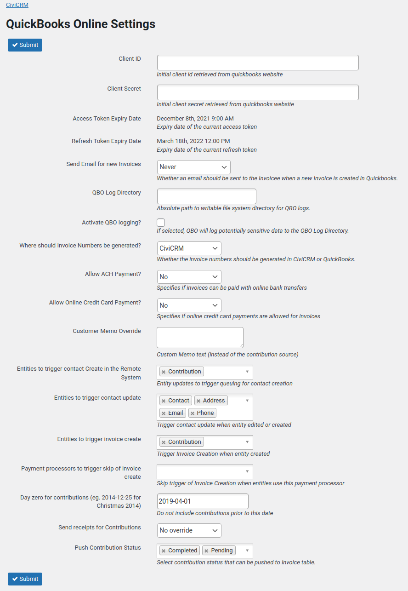

# README

CiviCRM Extension which integrates CiviCRM with [QuickBooks
Online](https://www.intuit.com.au/). CiviCRM Contacts and Contributions are
pushed to your QuickBooks Online account, QuickBooks Invoices are pulled into
CiviCRM, updating the Contribution status. Synchronise all things!

Integration of the two systems saves you time by not having to do repetitive
data entry in your accounting system and CiviCRM. This extension does the work
for you!

QuickBooks Online provides different Tax APIs for US and non-US countries. This
extension has been developed and tested with:

1. QuickBooks Online, Australia (AU)
2. QuickBooks Online, United States (USA)
3. QuickBooks Online, United Kingdom (UK)
4. QuickBooks Online, Canada (CA)

CiviQuickBooks will only synchronise contacts to Quickbooks Online from your
CiviCRM when a Contribution is added to them, either through online payments or
administrator action.

CiviQuickBooks version 2 implements the OAuth 2.0 protocol for QuickBooks
Online - if you are upgrading from a previous version you will need to generate
new keys.  See the [Configuration](#configuration) section below.

## Installation

1. Ensure the CiviContribute component is enabled
2. Download the [latest version of this
   extension](https://github.com/agileware/au.com.agileware.civiquickbooks/releases)
3. Unzip in the CiviCRM extension directory, as defined in `System Settings /
   Directories`.
4. Download the CiviCRM extension, **[Account
   Sync](https://github.com/eileenmcnaughton/nz.co.fuzion.accountsync/archive/master.tar.gz)**.
5. In CiviCRM, go to `System Settings / Extensions` and enable both extensions,
   **Account Sync** and **QuickBooks Online Integration**.
6. `QuickBooks` will now be available in the `Administer` menu.
7. Click on the `QuickBooks` menu to display the `QuickBooks Online Settings` page.
8. Update the CiviQuickBooks Online configuration as detailed below.

## Configuration

### To use this extension, you need to generate a QuickBooks Online consumer key and secret.

1. You will need an Intuit Developer Account, sign up at
   (https://developer.intuit.com/). This account must be added as a user of `Admin` user type to the
   QuickBooks Online company being integrated.
2. Once your developer account is created and linked, Go to the `My Apps`
   section and select `Create new app`.
3. Use the `Select APIs` button in the `Just start coding` card, then select the
   Accounting API.
4. From the App dashboard, select the `OAuth 2.0 keys`
5. In the `Production Keys` section, copy the `Client ID` and `Client Secret`
   keys.
6. Paste these values into the CiviQuickBooks Online Settings page and submit.
7. Copy the Redirect URI that is present into the `Production Keys` section of
   your App in the Intuit Developer site.

CiviQuickBooks Online Settings page is shown below.

#### Authorise CiviQuickBooks access to your QuickBooks Online account.

1. Click the `Authorize` link as shown below the `Access Token Expiry Date`
   field.
2. The QuickBooks Online Authentication page will now be displayed.
3. Follow the instructions and to complete the authentication process.
4. After authentication, you will be redirected back to CiviCRM.
5. Open the `QuickBooks Online Settings` page.
6. To confirm QuickBooks Online authentication a date will be shown in the
   `Access Token Expiry Date` field. If no date is shown then authentication has
   failed. Repeat the process.

### Map your QuickBooks product/service to CiviCRM Financial account codes

Each QuickBooks Product/Service has a unique name. This is used in the CiviCRM
Financial Account codes to correctly code each Invoice in QuickBooks Online.

1. Open the QuickBooks Company, go to product/service settings page
   ([https://sandbox.qbo.intuit.com/app/items](https://sandbox.qbo.intuit.com/app/items)).
2. Identify each QuickBooks Product/Service that you want to sync with CiviCRM.
3. Open the CiviCRM Financial Account setting page
   (civicrm/admin/financial/financialAccount) and update the `Acctg Code` of
   corresponding Financial account to be the same as each QuickBooks
   Product/Service name:
   
4. When setting up Contributions in CiviCRM, ensure that the Financial Type for
   the Contribution is set to use the correct Financial Account as the Income
   Account.
5. During sync, the Contribution line item will be set to the corresponding
   QuickBooks Product/Service.
6. When a CiviCRM `Acctg Code` does not match any QuickBooks Product/Service
   name, which means that no product/service in QuickBooks has the
   same name, that particular line item will **NOT** be pushed through the
   invoice.

### Map your QuickBooks tax account name to corresponding CiviCRM financial type`s Sales Tax Account`s `acctg code`. 

When the extension pushes an invoice to QuickBooks Online, it requires every
item to have a specified Tax account.

#### For AU Companies:

1. Go to `GST` > `Rates&Settings`. There are many tax accounts listed there,
   with names in column `Tax name`, copy the tax name you want and paste it into
   the `Acctg code` field of corresponding Tax financial account.
2. Open the CiviCRM Financial Account setting page
   (civicrm/admin/financial/financialAccount) and update the `Acctg Code` of
   corresponding Financial account to be the same as each QuickBooks tax account
   name.
3. If a financial type does not contain any GST, a financial account also needs
   to be created with the corresponding Tax account name in QuickBooks filled
   out. For example, create a new financial account called `NO GST` with GST
   rate as `0`, `acctg code`as `GST free` (a tax account name which has GST rate
   as `0` also). And assign that financial account as corresponding line item`s
   `Sales Tax account`.
4. When setting up Contributions in CiviCRM, ensure that the Financial Type for
   the Contribution/line item is set to use the correct Financial Account as the
   `Sales Tax Account`.
5. During sync, the Contribution line item will be assigned with corresponding
   Tax account.
6. When a CiviCRM `Acctg Code` does not match any QuickBooks Tax account name,
   which means that the there is no tax account in QuickBooks has the same name,
   that particular line item will **NOT** be pushed through the invoice.

#### For US Companies:

1. For US companies, each line item or product/service in an invoice can only be
   marked with `NON` (for non-taxable) or `TAX` (taxable), and the entire
   invoice will have a single tax rate selected as a state tax or a combination
   tax rate.
2. Users need to make sure that:
 - In CiviCRM:
    - The financial type of each line item in the contribution is associated
      with a `sales tax financial account`
      - All those associated financial accounts need to have `TAX` or `NON` as
        the `acctg code` field.
      - All those associated financial accounts need to have `Tax Rate Name` of
        desired tax rate account in QuickBooks as the `account type code` field
        in CiviCRM. e.g. `California` as the `financial type code`.
      - Make sure that all the financial types of line items have the same value
        of `account type code` in the `sales tax financial account`. The
        extension will pick the first line item that is taxable and with a
        `account type code`. And use that name to get the ID of `tax account`
        from QuickBooks Online.
  - In QuickBooks Online:
      - Make sure there are matched products/services that have the name that is
 same with the values of the `acctg code` of all `Income financial account` of
 all `financial types` used in the contributions.
      - Make sure all used `tax accounts` have been created and have names
        recored in the `account type code` of the `sales tax financial account`
        of matched `financial type`.

### Are you using a QuickBooks Online Production or Development account?

This extension currently assumes that it will be connected to a QuickBooks Online, `Production` account.
If instead, you wish to connect this to a QuickBooks Online `Development` account then open the `QuickBooks Online Settings` page and change the `Environment` option from `Production` to `Development`.
When you have finished testing in the Development account, then change the `Environment` option back to `Production`.

For more details on the QuickBooks Online environments, see:
* https://developer.intuit.com/app/developer/qbo/docs/develop/sandboxes
* https://developer.intuit.com/app/developer/qbo/docs/develop/sdks-and-samples-collections/php/configuration

# Special Notes:

1. As line items that have no matched QuickBooks product/service name filled out
   or no matched QuickBooks tax account name filled out will not be pushed in
   the invoice, an invoice could have less items pushed. If an invoice does not
   have even one item in it after the filtering, the invoice will not be pushed
   successfully.
2. As long as an invoice has at least one item in it after filtering, the
   information about those non-pushed items will be noted down as `customer
   memo` field. The `id` of the problematic financial type and its `acctg code`
   will be listed. In that case, you need to fix the invoice manually.

# Funding for this CiviCRM extension

Development and support for this Extension is funded solely by Agileware and CiviCRM community contributions. Agileware does not receive any funding at all for this Extension from the CiviCRM Partner program or CiviCRM LLC. Agileware welcome any funding to help continue paying Agileware staff to continue contributing to the CiviCRM community and Extensions.

[:heart: Donate to Agileware](https://www.paypal.me/agileware) to tell us how much you appreciate Agileware's CiviCRM open source work and community contributions.

# About the Authors

This CiviCRM extension was developed by the team at
[Agileware](https://agileware.com.au).

[Agileware](https://agileware.com.au) provide a range of CiviCRM services
including:

  * CiviCRM migration
  * CiviCRM integration
  * CiviCRM extension development
  * CiviCRM support
  * CiviCRM hosting
  * CiviCRM remote training services

Support your Australian [CiviCRM](https://civicrm.org) developers, [contact
Agileware](https://agileware.com.au/contact) today!

